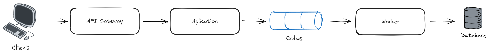
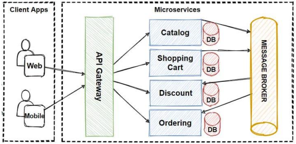

# PRUEBA TECNICA - DESARROLLADOR GOLANG

### 1. Problema de diseño

**Api Gateway** 

Es el unico punto de entrada de todas las solicitudes provenientes de las aplicaciones cliente y las redirige al microservicio correspondiente.

**Aplication**

Es la aplicación principal que recibe las solicitudes de los clientes. En lugar de procesarlas inmediatamente, las encola en un sistema de colas de mensajes

**Cola**

Aquí es donde se almacenan las solicitudes entrantes para ser procesadas de manera asíncrona.

**Worker**

Es el encargado de procesar las solicitudes en la cola y  las ejecutan en la base de datos de manera controlada.

**Database**

La base de datos SQL que almacena la información.

---
### 2. Encriptar tu mensaje

[Encrypt message file](https://github.com/MikelSot/prueba-tecnica-Think/blob/main/encryptmessage.go)

---

### 3. Suma a cero

[Zero sum file](https://github.com/MikelSot/prueba-tecnica-Think/blob/main/zerosum.go)

---
### 4.  Aprendizaje

**Api Gateway**

Es el unico punto de entrada de todas las solicitudes provenientes de las aplicaciones cliente y las redirige al microservicio correspondiente.

**Microservices**

Cada uno de estos componentes representa un microservicio independiente que maneja una funcionalidad específica dentro del sistema.

Catalog: Maneja la información de los productos disponibles, como descripciones, precios, e imágenes.

Shopping Cart: Administra el carrito de compras de los usuarios.

Discount: Gestiona las promociones y descuentos.

Ordering: Procesa las órdenes de compra.

**DB**

Cada microservicio tiene su propia base de datos, lo que es una práctica recomendada en arquitecturas de microservicios para evitar el acoplamiento entre servicios y garantizar la autonomía de cada uno.

**Message Broker**

Es un componente que permite la comunicación asíncrona entre microservicios. Los microservicios pueden enviar y recibir mensajes a través del Message Broker.

---
### 5.  Demostracion de hallazgos

En este nuevo sistema, todo se hace más rápido porque cada servicio se concentra en su tarea específica. 
Si un día tenemos más usuarios, podemos agregar mas servicios sin afectar el trabajo de los demás.
Este enfoque es lo que llamamos "microservicios".

**Beneficios para el negocio:**

**Mayor velocidad de respuesta:** Al tener servicios(microservicios) enfocados en tareas específicas, nuestros usuarios recibirán respuestas más rápido. 
Esto significa menos tiempo de espera y una mejor experiencia para ellos.

**Escalabilidad:** Si vemos que más usuarios están llegando, podemos agregar más servicios (es decir, más microservicios) para manejar la demanda sin comprometer la calidad del servicio.

**Resiliencia:** En nuestro sistema, si una parte falla, las demás seguirán funcionando, minimizando los tiempos de inactividad.

**Flexibilidad para el futuro:** Si decidimos agregar un nuevo servicio(una nueva función en el sistema), podemos hacerlo sin interrumpir las operaciones actuales.
Esto nos permite innovar más rápido y adaptarnos mejor a las necesidades del mercado.